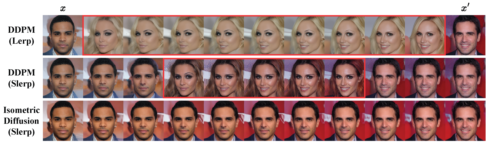
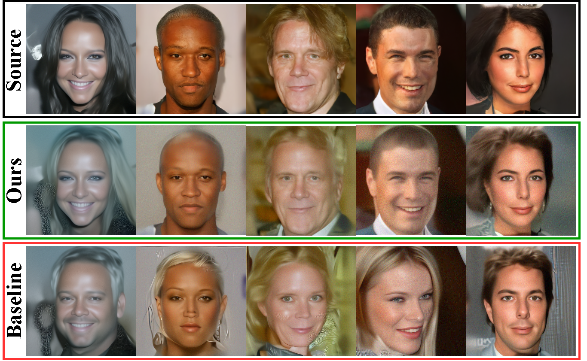

# Isometric Representation Learning for Disentangled Latent Space of Diffusion Models

> Jaehoon Hahm\*, Junho Lee\*, Sunghyun Kim, Joonseok Lee
> (* equal contribution)


This repository is the official Pytorch implementation for Isometric diffusion.


<p align="justify">
    <strong>An illustration of latent traversal between two latents $x$ and $x'$</strong>.
    <em>Top</em>: naive linear interpolation (Lerp) assuming Euclidean space. The starting point $x_T$ is linearly interpolated.
    <em>Mid</em>: spherical interpolation (Slerp) between $x$ and $x'$ (direction $x \rightarrow x'$ is entangled with an unwanted gender axis, inducing abrupt changes).
    <em>Bottom</em>: Slerp with the same latents using our Isometric Diffusion to resolve unwanted entanglement.
</p>

## Setup
**Setting the environment.**
```
conda create --name isodiff python=3.9
conda activate isodiff
pip install torch==2.0.1 torchvision==0.15.2
pip install -r requirements.txt
```

**Setting the Dataset.**
Change the 'DATASET_PATH' in 'submit_celeba.sh' and 'submit_celeba_ldm.sh' to CelebA-HQ dataset path.
Your directory structure should look like:
```
$DATASET_PATH/xxx.png
$DATASET_PATH/xxy.png
$DATASET_PATH/[...]/xxz.png
```

## Training
```
# set accelerate. [https://huggingface.co/docs/accelerate/quicktour] 
# DDPM
bash submit_celeba.sh

# LDM
bash submit_celeba_ldm.sh
```

## Results
### Image Interpolation


### Image Inversion and Reconstruction
<p align="center">
  
</p>

### Linearity

### Linear Combination


## Citation
```
TODO
```
